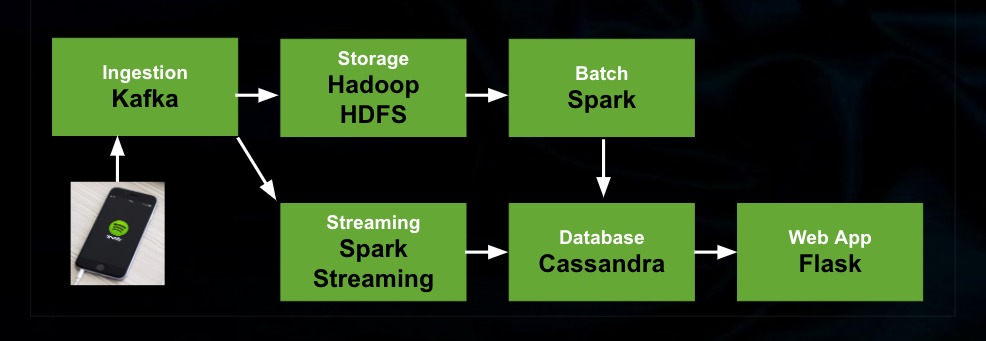

# For better listening!

A data pipeline to extract user feedback and drive next generation product better.

This is the project I built as Insight Data Engineering fellow at the fall of 2017.

# Motivation:
Companies constantly make changes to their product or design experiments to understand users.  It would be helpful to implement a tool that can  extract user feedback so they can incorporate that information and improve next generation product. 
Take Spotify for example, the app also play commercials when users are listening on the app.  I want to find out the relationship between advertisement rate and user reactions, which includes, membership upgrade, downgrade or cancellation. It is also very interesting to compare membership cancellation with new user registration. 

# Pipeline:

I simulated my input data in son format, and the data schema is very similar to real Spotify Data. I also used user_ID to label the group, in other words, I am testing different advertisement rate as my input on different groups of users. 

Kafka is used for ingestion.  

In the branch of batch processing. The data from Kafka were all consumed by Hadoop HDFS as the storage for all my raw information,  these data can be used expand the project and add other features to the project. Spark does batch processing using data from HDFS, the results were stored in Cassandra.

Another branch of the pipeline is realtime processing using Spark Streaming, to deal with cases when people are testing on the same group of users with changing experiment condition, and a realtime display of user feedback is preferred.  

Results from batch processing and realtime processing were stored in Cassandra.

WebUI is built using Flask.

[Slides](https://docs.google.com/presentation/d/1N2-nDMtxjDX93CrJ7jt3fOPZaP8x_pthHvoJJy9cqQI/edit#slide=id.p)

[Demo](http://www.shanshanqin.com)

[Video](https://youtu.be/9I_wYYNkpFA)
